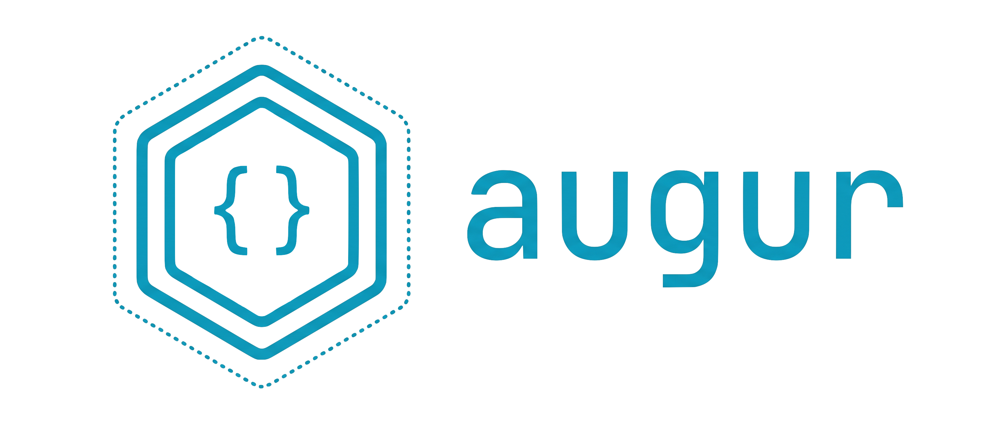

<p align="left">
  <a href="LICENSE"></a>
</p>

<p align="center">
  
</p>

Run Claude Code in an isolated environment.
Works in any directory — only the current directory is exposed to the container or VM.
It must be a directory that does not contain augur itself: `augur up`/`claude`/`shell` refuse to run
in `$HOME`, in `~/.augur`, or in any parent of either, because the workspace is shared **read-write**
and those hold the binaries your host runs (see
[ADR-0014](docs/decisions/0014-workspace-must-not-contain-augur.md)). Use a subdirectory instead.

Two modes are available:

| | Container mode | macOS VM mode |
|---|---|---|
| **Isolation** | Linux container | macOS VM (Apple Virtualization Framework) |
| **Xcode / xcodebuild** | ✗ | ✓ |
| **iOS Simulator** | ✗ | ✓ |
| **Setup time** | ~5 min (image build) | ~75 min (VM build) |
| **Disk usage** | ~2 GB | ~70 GB+ |
| **Requires** | Apple Container (macOS 26+) | augur-vm (bundled), IPSW, Xcode XIP |

---

## Container mode (default)

Lightweight Linux container. Suitable for most projects that don't need Xcode.

The container is hosted by **Apple Container** (`container`, github.com/apple/container) on **macOS 26+** — native to macOS, no Docker Desktop, no licensing; each container runs in its own lightweight Linux VM. `augur status` shows the active engine.

### Setup

```bash
# 1. Get augur — the `release` branch is the gated stable channel
git clone -b release https://github.com/h1d3mun3/augur.git
cd augur

# 2. Run the install script
bash install

# 3. Reload shell config
source ~/.zshrc  # or source ~/.bashrc

# 4. Build the image
augur build
```

The install script copies `Dockerfile` and `augur` to `~/.augur/` and configures `PATH`. Safe to re-run.

> **Stable vs. bleeding-edge.** Cloning `-b release` installs the latest release that passed the full macOS-VM E2E gate — `augur version` then reports a bare `X.Y.Z`. To follow development instead, clone `main` (the default branch); `augur version` reports `X.Y.Z-dev+<sha>` so you can always tell the two apart. Pin an exact version with `git clone --branch vX.Y.Z`. See [Cutting a release](#cutting-a-release-structural-gate).

> **Apple Container only:** `augur build`/`augur update` implicitly starts a BuildKit "builder" VM (~2 CPU/2GiB) that keeps running after the build finishes, to speed up the next one. It's a single instance shared by every `container build` on the machine — not scoped to a project — so augur deliberately never stops it for you (doing so from one project's `down`/`build` could kill another project's in-flight build). If you want to free the RAM/CPU, run `container builder stop` yourself once you're sure nothing else is building.

### Usage

```bash
cd ~/projects/my-app

augur up [--swift VERSION]      # start the container
augur claude                    # launch Claude Code
augur shell                     # open a bash shell (for debugging)
augur setup-token               # get a Claude subscription token (runs in the guest, saves on the host)
augur down                      # stop the container (kept for a fast, cache-preserving restart)
augur destroy                   # stop and remove the container entirely (+ its egress network)
augur status                    # show status, toolchain, and auth info
augur list                      # list all augur containers across projects, with state + address
augur build [--swift VERSION]   # build the container image
augur update [--swift VERSION]  # rebuild image with latest tool versions
augur init-conf                 # scaffold ./.augur/{allowlist,resources}.conf
augur version                   # show augur version
```

### File access

| Path | Description |
|------|-------------|
| Current directory | mounted at `/workspace-<project>` (read/write), named after the directory |
| `~/.claude/projects/-workspace-<project>` | **only this project's** Claude history is shared (read/write) — not the rest of `~/.claude`, so other projects' transcripts and host auth/settings stay invisible |
| `~/.claude/agents/` | **this project's** user-level custom subagent definitions (`/agents`) are persisted (read/write), keyed per-project under `~/.augur/claude-agents/<project>` — so they survive `augur down`/`up` **and** `destroy`/recreate. Isolated per project (not the host's global `~/.claude/agents`), so a guest can't plant a subagent read by another project. Project-level `.claude/agents/` in the repo work too, via the workspace mount. |
| `~/.augur/claude-profile/` | **opt-in** operator profile, mounted **read-only** — your personal `commands/`, `skills/`, `rules/`, `output-styles/`, `workflows/`, `themes/`, `CLAUDE.md`, `settings.json` and `keybindings.json` are wired into the guest's `~/.claude/`. Absent or empty (the default) wires nothing. See [Operator profile](#operator-profile). |
| `~/.config/gh/` | mounted **read-only** (the container can read but not rewrite it; the token is injected via `GH_TOKEN`) |
| `~/.gitconfig` | mounted read-only |
| Claude auth | injected via env (`CLAUDE_CODE_OAUTH_TOKEN` / `ANTHROPIC_API_KEY`) — the host's credential store is never mounted |
| Everything else | **not visible to the container** — including the rest of `~/.claude` and the host's `~/.claude.json`, which augur never reads, copies, or mounts ([ADR-0013](docs/decisions/0013-claude-config-inheritance.md)) |

#### Operator profile

augur **never mirrors your host `~/.claude`** — that tree is executable config (hooks, skills,
commands), it is full of host-absolute paths that break in a Linux guest, and its permission set was
written for a world with no sandbox. The full reasoning is in
[ADR-0013](docs/decisions/0013-claude-config-inheritance.md).

What you get instead is a directory you populate on purpose:

```
~/.augur/claude-profile/
├── settings.json      → copied     (Claude rewrites it at user scope)
├── CLAUDE.md          → copied     (/memory can edit it)
├── keybindings.json   → copied     (the TUI owns it)
├── commands/          → symlinked  (host edits live in Container mode — see the macOS caveat)
├── skills/            → symlinked
├── rules/             → symlinked
├── output-styles/     → symlinked
├── workflows/         → symlinked
└── themes/            → symlinked
```

- **Opt-in and inert by default.** No directory, or an empty one, and augur wires nothing. Only
  names that actually exist in the profile are ever written into the guest — ship no
  `settings.json` and augur never touches yours.
- **Host-global, read-only.** One profile for every project on the machine: personal tooling is not
  project-scoped. Read-only *because* it is shared — a guest able to write there would plant a hook
  or command for every project.
- **In Container mode the directories are live**, in two senses. Editing a file *inside* an
  already-wired directory (adding a command to `commands/` that's already there) needs no augur
  action at all — you're editing the live mount, and the next `augur claude` sees it.
  Adding/removing/replacing a whole entry (populating `commands/` for the first time, or deleting
  it) needs augur to re-run the wiring, which happens on **every** `augur claude`/`shell`/`up`, not
  just when the container happens to restart. (Claude Code itself only *scans* a top-level
  `skills/`/`commands/` directory that existed when its session started, so the very first time you
  populate one, exit and relaunch `claude` once — that part isn't augur's to fix.)
- **The three JSON/markdown files are copies**, refreshed on that same every-`claude`/`shell`/`up`
  cadence, because Claude Code writes user-scope `settings.json` and a read-only symlink would make
  that an error. The profile is their source of truth: if you ship one, guest-side edits to it do
  not survive the next wiring.
- **Your own files are never deleted.** If the guest already had a real `~/.claude/commands` or
  `~/.claude/skills` when you first populate the profile, augur moves it aside to
  `<name>.pre-profile` rather than replacing it (an empty one is simply dropped).
- **macOS VM mode caveat — profile edits need a VM restart.** The profile works there (it is shared
  read-only into the VM and wired the same way), but macOS mode reaches it over a **virtiofs share**
  rather than a bind mount, and the macOS guest's virtiofs client keeps serving **stale file data**
  after a host-side edit. A 105-arm experiment measured it: a file stayed stale for **904.9 s** with
  no natural refresh, and then every share went fresh together **10.3 s after a guest vnode reclaim
  was forced**. The delay is therefore not a timeout you can wait out — nothing expires.
  Two things this document used to claim are wrong and are corrected here: it is **not** specific to
  read-only shares (the read-write workspace share behaves identically — see
  [issue #135](https://github.com/h1d3mun3/augur/issues/135)), and content does **not** reliably
  become visible "before the 10-minute mark".
  So if you change the profile while a VM is running, run `augur down --macos && augur up --macos`
  to pick it up. That works because the guest **reboots with an empty vnode cache**, not because a
  fresh `vm run` rebuilds the share device — a distinction that matters to anyone trying to fix
  this. Container mode is unaffected, and that is diagnostic rather than incidental: a Linux guest
  reading the same host directory over a mount that is *also* virtiofs sees current content live, so
  the defect is in the **guest-side** client, not in the sharing mechanism or in `readOnly`.
  **augur warns you when this applies**: `augur claude --macos` / `shell --macos` check host-side
  whether the profile changed since the VM booted, and print the remedy if so — so the failure is
  never silent. See [issue #124](https://github.com/h1d3mun3/augur/issues/124) and
  [issue #135](https://github.com/h1d3mun3/augur/issues/135).

Your **repository's** own `.claude/settings.json`, `CLAUDE.md`, `.claude/commands/`,
`.claude/skills/` and `.mcp.json` already work with no setup — they arrive inside the workspace
mount. The profile is for what a repo cannot supply because it is yours, not the project's.

#### Prompt history across a recreate

augur recreates the container for its own reasons — a rotated credential, an egress toggle, a memory
change, `augur build`/`update`/`install-cert`. That discards the writable layer, and your up-arrow
prompt history (`~/.claude/history.jsonl`) lives there rather than on a mount. So augur keeps a
small, capped snapshot of just that file under `~/.augur/claude-carryover/<project>` (mode `0600`) —
taken when you exit `augur claude`/`shell`, on `augur down`, and before `build`/`update` throw the
layer away — and restores it into the fresh container.

It carries **prompt text only**: no credentials, no tool permissions, no trust state. And
**`augur destroy` deletes it**, so the clean-guest button stays a clean-guest button. Container mode
only — the macOS clone already survives `down`.

> Auth is env-based in both modes now. If you only ever logged in via the browser, run `augur setup-token` (or set `ANTHROPIC_API_KEY`); see [API keys and authentication](#api-keys-and-authentication). Upgrading from an older augur requires a one-time `augur build` (the image now pre-creates the scoped history dir). To activate `~/.claude/agents` persistence on a container/VM that already exists, recreate it once — `augur destroy && augur up` (or `augur down --macos && augur up --macos`); new containers/VMs get it automatically.

> **The read/write workspace mount includes `.git` — treat it as attacker-controlled.** A prompt-injected agent running inside the container can write `.git/hooks/pre-commit` (or `post-checkout`, `post-merge`, …) into the mounted repo. Git runs repo-local hooks with no trust prompt, so the next `git` command *you* run on the **host** in that repo executes guest-authored code at your full host-user privilege — a complete escape of both the container boundary and the egress allowlist. This isn't a bug augur can close in software: it's inherent to mounting a repo read-write so an agent can edit it. Review diffs before trusting them, and treat `.git/hooks` (and anything else the host later runs unreviewed, e.g. a `Makefile` or `.envrc`) in an augur-touched repo as attacker-controlled until inspected. See `docs/security-reviews/2026-07-10-egress.md` §6 item 12.

> Claude Code's `--worktree` isn't specially supported (`augur claude --worktree ...` won't forward the flag). If you want it anyway: run `augur shell`, then type `claude --worktree <name>` yourself at the prompt — the worktree's files/git state persist fine, and its conversation history survives `augur down && up` too — `cmd_up` mounts the whole `~/.claude/projects` parent to a per-project host dir, so every cwd-keyed leaf under this project (the main checkout **and** any worktree) is stored host-side and persists (only `augur destroy` plus deleting the host history dir removes it). See `docs/decisions/0004-no-special-worktree-support.md` for the full trade-offs.

### Disk cleanup

`augur down` now **stops** the container and keeps it (like `augur down --macos` keeps its VM
clone) so the next `augur up` restarts it fast, preserving the writable layer's caches and tool
state that live outside the mounted workspace. **`augur destroy`** removes *this project's*
container and its egress network when you're done with it (or to force a clean, from-scratch
container). `augur update`/`augur install-cert` rebuild the image, self-prune the previous
generation (`container image prune`), and remove this project's container so the new image takes
effect on the next `up` — other projects on the same image tag need their own `augur destroy &&
augur up`. For anything beyond that — stopped containers from projects you're finished with, or
reclaiming the shared builder's own resources — use `augur destroy` per project, or Apple
Container's own commands directly. `augur list` shows every augur container across projects
(filtered to the `augur-` prefix, unlike raw `container list`), so you can spot finished ones by
their project slug first:

```bash
container prune              # remove stopped containers
container image prune --all  # remove dangling AND unused tagged base images
container builder stop       # stop the shared BuildKit builder (see note above), or:
container builder delete     # delete it outright — also clears its own build cache
                              # (~/Library/Application Support/com.apple.container/build)
```

`augur` deliberately doesn't wrap these in a command of its own — they're already one-liners
in Apple's CLI, and disk cleanup beyond the automatic self-prune is rare enough not to carry
as a maintained wrapper. `container builder delete` is machine-wide, not scoped to this
project: it aborts any build in flight anywhere else on the Mac. See
`docs/decisions/0005-no-prune-command.md`.

### Requirements

- **Apple Container** (`container`) on macOS 26+
- bash

---

## macOS VM mode (`--macos`)

Full macOS VM built from an Apple-signed IPSW. Supports Xcode, xcodebuild, and iOS Simulator.
The VM is isolated per project — each directory gets its own thin clone of the base VM.

### Setup

#### 1. Build the VM backend

augur ships its own VM backend (`augur-vm`), a small Swift CLI built directly on
Apple's Virtualization.framework — no third-party tools required.

```bash
# on the macOS host (needs the Xcode / Swift toolchain)
git clone -b release https://github.com/h1d3mun3/augur.git && cd augur   # `-b release` = stable; drop -b for dev (main)
bash install        # builds & installs augur-vm into ~/.augur
```

#### 2. Download Apple-signed assets

- **IPSW** — macOS restore image: System Preferences > Software Update
- **Xcode XIP** — Xcode installer: https://developer.apple.com/download/all/

#### 3. Build the base VM (one-time, ~75 min)

```bash
augur build --macos --ipsw ~/Downloads/macOS.ipsw --xcode-xip ~/Downloads/Xcode.xip
```

This will:
1. Create a macOS VM from your IPSW (`augur-vm create --from-ipsw`)
2. Open the VM window for manual Setup Assistant completion (credentials: `admin` / `admin`, Remote Login enabled)
3. Install Xcode, Homebrew, GitHub CLI, and Claude Code
4. Download the iOS Simulator runtime (Xcode installed from a XIP does not bundle it)
5. Save the result as a reusable base VM (`augur-macos-base`)

By default only the **iOS** Simulator runtime is baked in. Use `--platforms` to bake in others —
baking them into the base VM means every project clone gets them without re-downloading:

```bash
# iOS + watchOS
augur build --macos --ipsw ... --xcode-xip ... --platforms iOS,watchOS

# every platform Xcode offers (watchOS, tvOS, visionOS, …) — many extra GB
augur build --macos --ipsw ... --xcode-xip ... --platforms all
```

> **Supply chain note:** The base VM is built entirely from Apple-signed assets (IPSW + Xcode XIP).
> No third-party automation scripts are used.

### Usage

```bash
cd ~/projects/my-app

augur up --macos        # clone base VM and start (first run clones automatically)
augur up --macos --gui  # same, but also open a VM window (display + keyboard + pointer)
augur claude --macos    # launch Claude Code  (starts VM if not running)
augur shell --macos     # open a bash shell   (starts VM if not running)
augur setup-token --macos  # get a Claude subscription token (runs in the VM, saves on the host)
augur refresh --macos   # push host-side edits into the running VM's view, now (never boots one)
augur down --macos      # stop the VM (keeps the clone — next up is fast)
augur destroy --macos   # stop and remove the project VM clone
augur status --macos    # show VM status, toolchain, and auth info
augur list --macos      # list all VMs and their state
augur update --macos    # update Claude Code in the base VM
augur version --macos   # show augur version (macOS mode)

augur up --macos --share-refresh attach            # keep the attach-time sweep, stop the 5s loop
augur up --macos --share-refresh off               # stop the shared-file refresh entirely
augur up --macos --share-refresh-interval 15       # same loop, longer period (default: 5)

augur config --share-refresh attach                # …and persist that, for THIS project only
augur config --share-refresh-interval 30           # (host-side; the guest cannot read or write it)
augur config --show                                # effective values + which layer set each
augur config --unset share_refresh                 # back to the default
```

### Authentication

On macOS, Claude Code stores its OAuth login in the Keychain, which is unreadable over SSH and
absent from a freshly cloned VM. So macOS mode injects a credential through the environment on
every `up` (the same way it does for the GitHub token):

- `CLAUDE_CODE_OAUTH_TOKEN` — subscription token; either set the env var / save it to
  `~/.claude_code_oauth_token`, or run **`augur setup-token`**: it runs `claude setup-token`
  inside the guest (so you don't install Claude Code on the host), then you paste the token
  back once and augur saves it to `~/.claude_code_oauth_token`.
- `ANTHROPIC_API_KEY` — Console API key (env or `~/.anthropic_api_key`). Takes priority if both are set.

### Guest clock

A cloned macOS guest boots with its wall clock a fixed amount **behind** the host's (measured at ~95
minutes on the machine this was found on — a constant inherited from the base VM's saved state, not
drift), and it cannot fix itself: NTP is UDP/123 and macOS VM egress drops UDP by design. So augur
**sets the guest's clock from the host's** over SSH — on `up --macos` (both a fresh boot and a
reconcile of an already-running VM) and on `claude`/`shell --macos`, which attach without going
through `up`. It runs before the token is injected, because a token minted on the host seconds ago
looks *not yet valid* to a guest sitting in the past. Best-effort: if it cannot be set you get a
warning, not a failed `up`. See
[`docs/decisions/0015-guest-clock-from-host.md`](docs/decisions/0015-guest-clock-from-host.md).

### File access

| Path | Description |
|------|-------------|
| Current directory | exposed at `~/workspace-<project>` in the VM (read/write, virtiofs auto-mount) |
| `~/.gitconfig` | **copied** on VM start (unlike container mode, which mounts it read-only). augur then rewrites `credential.https://github.com.helper` in **the guest's copy** so HTTPS `git push` works off `GH_TOKEN`; any helper the host set for `github.com` is replaced, including the pair `gh auth setup-git` writes, because those need a host path or the host Keychain the guest does not have. Your host file is never modified. |
| `~/.config/gh/` | **not shared** in macOS VM mode. It was, but nothing ever wired it to `~/.config/gh` inside the VM, so the config was never read — exposure without a feature. `gh` works there off the injected `GH_TOKEN`, which is the real auth path on a macOS host anyway (the token lives in the Keychain, not in `hosts.yml`). Container mode still mounts it read-only at the guest's real path, where it does work. |
| Claude history | **only this project's** history is shared, in a per-VM isolated dir (`~/.augur/claude-projects/<vm>`), so other projects' transcripts stay invisible. Cross-mode (container↔macOS) resume is no longer shared. |
| Claude auth | **not** shared — injected via env (the macOS Keychain is unreadable over SSH; see above) |
| Everything else | **not visible to the VM** |

> The macOS guest auto-mounts the shared directory under `/Volumes/My Shared Files/workspace-<project>`; augur
> symlinks it to `~/workspace-<project>`. The sealed system volume can't host a symlink at `/workspace`, so the
> per-project `~/workspace-<project>` path is used in the VM (container mode uses `/workspace-<project>`).

> Same `.git/hooks` host-code-execution risk as container mode: the workspace mount here is read/write too, so a
> prompt-injected agent can plant a hook that runs on the host at your privilege the next time you `git` in this
> repo. See the note in [Container mode's File access](#file-access) section.

> Same caveat as container mode for Claude Code's `--worktree`: not specially supported, but `augur shell --macos` +
> manually running `claude --worktree <name>` works today. Unlike container mode, its conversation history *does*
> survive `augur down --macos`/`up --macos` (the VM's disk is stopped, not destroyed, until `augur destroy --macos`).
> See `docs/decisions/0004-no-special-worktree-support.md`.

### Shared-file refresh (`--share-refresh`)

A macOS guest's virtiofs client keeps serving **stale file data** after you edit a file on the host —
on every share, read-only and read-write alike, with **no timeout** (one measured file stayed stale
for 904.9 s). Still present on **macOS 26.6**. So augur invalidates the guest's cache for the files
that changed: at every attach (`up`/`claude`/`shell --macos`), and again every **5 s** for as long as
the VM runs, which is the only thing that makes a host edit reach an agent that is *already running*.
See [`docs/decisions/0016-shared-file-cache-refresh.md`](docs/decisions/0016-shared-file-cache-refresh.md).

The cost scales with the number of **changed** files (~0.29 ms each, host + guest, paid serially), and
nothing caps that number — past roughly 17,000 changed files one sweep outlasts the 5 s interval and
the loop starts running most of the time on one core. An `npm install`, a big `git checkout` or a full
build can get there. Two run-scoped flags, written after the command:

| Flag | Attach-time sweep | 5 s loop | Freshness self-test |
|---|---|---|---|
| *(none)* / `--share-refresh continuous` | yes | yes | yes |
| `--share-refresh attach` | yes | **no** | yes |
| `--share-refresh off` | **no** | **no** | **no** |

`attach` is usually what you want for a large repo: the loop is the unattended, repeated cost, while
the attach sweep runs once, in front of you, and still leaves the guest fresh when work starts. `off`
is the full escape hatch — with it the guest can read stale files indefinitely and nothing will say
so, so `augur down --macos && augur up --macos` becomes the remedy again.

As a **flag** the setting is per run: pass it on each of `up`, `claude`, `shell` and
`setup-token --macos`. Any of those will stop a loop an earlier `up` left running, so you can drop the
cost mid-session by re-attaching with `augur claude --macos --share-refresh attach`. Anything but the
default prints a warning on every such run, naming the issues and how to restore it.
`augur status --macos` prints two lines: what *this* command line asks for (and which layer it came
from), and — measured — whether a refresh loop is actually running and how long ago the last sweep
completed. To stop retyping it, persist it with `augur config` (below).

`--share-refresh-interval <seconds>` changes the loop's period (a positive integer). `0` is refused
rather than treated as "off" — use `--share-refresh attach` or `off`, which say what they mean. A bad
`AUGUR_MACOS_REFRESH_INTERVAL` is only refused on the commands that start the loop; `down`, `destroy`,
`status` and `list` keep working, because those are how you stop a loop a bad value is spinning.

### Persisting it per project (`augur config`)

The right mode depends on **how many files your repo changes**, which is a property of the repo, not
of the run — so an operator who needs `attach` should not retype it forever:

```bash
augur config --share-refresh attach          # for this project, from now on
augur config --share-refresh-interval 30
augur config --show
augur config --unset share_refresh
```

```
Project:                /Users/hidemune/GitHub/big-monorepo
Settings file:          ~/.augur/project-settings/big-monorepo-908d688ef046.conf

share_refresh           attach      (settings file)
share_refresh_interval  5           (default)
```

**Precedence: flag > settings file > `AUGUR_MACOS_REFRESH_INTERVAL` > built-in default**, and
`--show` names the winning layer for each key — with four of them, "which layer won" is the only
useful answer to "why is my edit not showing up". The file beats the env var because the export's one
persistent home is a shell profile, i.e. every project in every shell, while the file is one project
you chose; a stale export must not quietly override it.

The file is **host-side**, under `~/.augur/project-settings/`, keyed on the project's full path — and
deliberately **not** `./.augur/`. That directory is inside the read-write share, so the guest can
write it, and a guest that can set its own `share_refresh` can switch off the mechanism that keeps
your view of that guest honest. `~/.augur` is in no share, in either engine. `.augur/resources.conf`
being guest-writable is not a counter-example: inflating its own VM is a request you *see applied*,
while silencing a freshness check is invisible by construction. See ADR-0016 §6.1.

`augur config` needs no `--macos` (it writes a file and boots nothing) and is not a VM command, so it
works on a host with no VM backend. A malformed value in the file **warns and is ignored** — it never
refuses a command, because unlike an export this file survives `destroy --macos`, so a refusal would
be permanent and would take `augur down --macos` with it. Unknown keys are warned about, ignored, and
preserved on rewrite, so an older augur cannot eat a newer one's setting.

`destroy --macos` does **not** delete it. It reaps VM state; this is your intent about the project,
and `destroy --macos && up --macos` is a remedy augur itself recommends. `augur config --unset`
is the only thing that removes it.

### Refreshing on demand (`augur refresh --macos`)

```bash
augur refresh --macos
```

Sweeps the shared directories once, against the VM that is **already running**, and says what
happened on every path: the file count and the ones the guest could not invalidate by name, "nothing
has changed since the last sweep", or the reason it swept nothing at all. This is the replacement
for the loop when you turn it off: without it, the only ways to get a host-side edit into a running
guest are to attach (`up`/`claude`/`shell`, all of which put you *in* the guest) or to wait, and
waiting is the one thing that does not work.

**Its exit status means something**, so `augur refresh --macos && swift test` is safe to write. It
exits non-zero if the sweep did not happen (another sweep held the lock) or did not do its job (the
round trip failed, or the guest declined to invalidate files — `msyncfail`/`nomap`). A file the guest
reported as `unstable` — one a host-side build kept rewriting mid-sweep — is named but is not a
failure. The automatic sweeps on `up`/`claude`/`shell` and in the loop stay best-effort and never
fail their command: a stale share is degraded, not broken, and a bring-up must not die on one.

It **never boots a VM.** If none is running it says so and stops: a stopped guest has no cache to
invalidate, and the `up` that would start it sweeps on the way in anyway. If the VM is running but
the host cannot reach it (gvproxy down), it says *that*, rather than reporting a sweep it could not
make.

It works under **`off`** — that mode means "don't refresh on your own", not "never refresh", so
`augur refresh --macos` sweeps rather than silently doing nothing. That matters most for a mode you
**persisted**: `augur config --share-refresh off` applies to every command in the project, so this is
the command that gets an edit into the guest without turning the loop back on, and it is what keeps
`off` a setting rather than a one-way door. It then prints one line saying the automatic refresh is
still off — naming the settings file and `augur config --unset share_refresh` if that is where the
mode came from, rather than talking about a flag you did not type — so a successful manual sweep
cannot be mistaken for `off` having lapsed. Unlike the attaching commands it does *not* stop a refresh loop an earlier `up`
left running: it makes no claim about one, and `augur status --macos` is where that half is measured.
Stopping the loop stays with `--share-refresh attach|off` on `up`/`claude`/`shell`, or with
`augur down --macos`.

### Running `xcodebuild test`

`xcodebuild test` needs an Aqua (GUI) login session to reach `testmanagerd`; a headless SSH login
has none. Two things make that session exist at boot: the base VM is built with **auto-login**
enabled, and the VM is always run with a **virtual display device** (macOS only starts an Aqua
session when a framebuffer exists — `--no-graphics` suppresses only the host-side window, not the
display device). With both in place, `xcodebuild test` works over SSH for all test types. Recommended
invocation (SwiftData's `@Model` macro needs `-skipMacroValidation` in a headless VM):

```bash
NSUnbufferedIO=YES xcodebuild test \
  -scheme <Scheme> \
  -destination 'platform=macOS,arch=arm64' \
  -parallel-testing-enabled NO \
  -skipMacroValidation \
  -derivedDataPath ~/DerivedData \
  CODE_SIGNING_ALLOWED=NO
```

If builds are flaky from the shared mount (virtiofs is not tuned for heavy I/O — occasional
"project is damaged" errors), copy the project to local disk first: `rsync -a ~/workspace-<project>/ ~/Developer/<app>/`.

### Disk cleanup

`augur destroy --macos` removes the *current* project's VM clone — but augur names a clone
from its project directory, so if that directory is later renamed or moved, the old clone
becomes unreachable by `destroy` (it's still on disk, just under a name `destroy` no longer
computes). `augur list --macos` still shows it; remove it directly:

```bash
augur list --macos       # every VM the store knows about, by name — not just this project's
augur-vm stop <name>     # if it's running
augur-vm delete <name>   # remove that VM/clone
```

Same story for `~/.augur/claude-projects/<vm>/` — a per-clone Claude-history directory that
`destroy --macos` doesn't touch either; it's plain files, safe to `rm -rf` once you know the
clone is gone for good. Both are accepted, documented trade-offs, not oversights — see
`docs/decisions/0004-no-special-worktree-support.md` (§9, "What actually shipped") and
`docs/decisions/0005-no-prune-command.md`.

### Requirements

- macOS (Apple Silicon)
- Xcode / Swift toolchain (to build the bundled `augur-vm` backend via `bash install`)
- macOS IPSW (Apple-signed)
- Xcode XIP (Apple-signed, from developer.apple.com)

---

## Egress allowlist (`.augur/allowlist.conf`)

Restrict the container/VM to a set of domains — everything else is blocked. Enforcement runs in a small proxy on the **host, as your user — it never needs `sudo`**. Useful for sandboxing an agent so it can only reach the services it should.

**On by default.** Filtering is always active using a **managed baseline** (`~/.augur/augur.conf.default`, shipped with sensible defaults and refreshed on every install). Add your own always-on domains to `~/.augur/augur.conf`, or per-project ones to a `./.augur/allowlist.conf` in the project root. To disable for one run, pass `--no-egress`.

```bash
cd ~/projects/my-app

# Optional: extend the baseline with project-specific domains
augur init-conf   # scaffolds ./.augur/allowlist.conf
cat >> .augur/allowlist.conf <<'EOF'
registry.example.com
api.myservice.com
EOF

augur up            # container, egress on (baseline + augur.conf + allowlist.conf if present)
augur up --macos    # macOS VM, same
augur up --no-egress  # disable egress filtering for this run
augur up --egress     # force egress filtering on (re-enables if AUGUR_EGRESS=0)
augur status        # shows: Egress on/off + the active allowlist
```

Filtering is on by default; set `AUGUR_EGRESS=0` to disable it persistently, or `AUGUR_EGRESS=1` to force it on. The `--no-egress` / `--egress` flags override that environment variable for a single run.

### `.augur/allowlist.conf` format

One pattern per line, `#` for comments:

| Pattern | Matches |
|---|---|
| `example.com` | that exact host (the apex) only |
| `*.example.com` | subdomains only (`api.example.com`, not `example.com`) |
| `.example.com` | the apex **and** all subdomains |

The effective list is three layers merged (union — a layer can only widen, never narrow):

1. **Managed baseline** (`~/.augur/augur.conf.default`) — shipped defaults for Claude Code / GitHub / Homebrew. augur owns this file and **refreshes it on every install**, so shipped domain updates reach you automatically. Don't edit it; your changes are overwritten.
2. **Your global additions** (`~/.augur/augur.conf`) — always-on domains you add. **Never overwritten** by install.
3. **Project** (`./.augur/allowlist.conf`) — per-project domains.

The merge happens on the host, so the guest can't widen its own policy by editing the mounted file. Edits take effect on the next `augur up`.

**Project domains require approval (trust-on-first-use).** Because `./.augur/allowlist.conf` ships inside a repository you may not fully trust, augur shows the domains it adds and asks you to approve them on first sight and again whenever the file changes — the same model as SSH host keys. The approval fingerprint is stored host-side under `~/.augur/project-hashes/` (never in the project tree or a mounted share), so a compromised guest that rewrites `./.augur/allowlist.conf` cannot get the change honored without a fresh host-side approval. `augur status` shows the project's domains and whether they're approved. For non-interactive / disposable runs (CI), set `AUGUR_ACCEPT_PROJECT_CONF=1` to accept automatically; without a TTY and without that variable, an unapproved/changed conf fails closed.

### How it works

| Mode | Enforcement |
|------|-------------|
| **Container** | The agent runs on a **host-only** `--internal` network (internet severed; the host reachable) with `NET_ADMIN` dropped and `--no-dns` (external DNS fails closed). The **host-side** `augur-proxy` is its only egress, reached via the host-only gateway. A boot self-test fails closed if direct egress is ever reachable. **Trade-off:** host-only also lets the agent reach other host services bound to `0.0.0.0`; closing it would need host `pf` rules (sudo), which augur avoids. |
| **macOS VM** | The guest's only NIC is a host-owned socket (`VZFileHandleNetworkDeviceAttachment`); a bundled `gvproxy` runs the guest's network on the host and funnels every connection to the proxy. Needs no special entitlement. |

In every mode the proxy decides by domain (the CONNECT host, or the TLS SNI / HTTP Host) and connects out by name.

### Requirements

`install` builds the proxy (`augur-proxy`, Swift) automatically — both container and macOS VM modes run the native host `augur-proxy`. **macOS VM egress also needs Go** (for `augur-gvproxy`) — `brew install go`, then re-run `bash install`. Without it, macOS VM egress is unavailable but everything else works.

The host ports the proxy uses are derived per-project so two egress-enabled projects can run at once; override with `AUGUR_PROXY_HTTP_PORT` / `AUGUR_PROXY_SOCKS_PORT` / `AUGUR_SSH_FWD_PORT` if needed.

> **Scope.** This guarantees *"the guest can only reach allowlisted domains."* DNS is gated on the same allowlist (a name resolves only if it's connectable), so the guest can't tunnel data out via DNS queries either. It is still **not** exfiltration-proof: an allowlisted, writable host (e.g. `github.com` with your `GH_TOKEN`) and the shared workspace are intentional channels. This is a deliberate, accepted boundary, not a gap augur intends to close — see [`docs/decisions/0008-exfiltration-ceiling-accepted.md`](docs/decisions/0008-exfiltration-ceiling-accepted.md) for why. See also `augur-proxy/README.md` and `gvproxy/README.md`.

---

## Container & VM resources (`.augur/resources.conf`)

Both modes size their guest from the same file — `MEMORY=` for container mode, `MACOS_CPU=`/`MACOS_MEMORY_MB=` for macOS VM mode — so one `.augur/resources.conf`, committed to the project, covers whichever mode(s) you use.

### Container memory

Apple Container's per-container default memory (~1 GB) is too tight for running an agent, so augur passes `--memory 4g` by default.

To change the default for a project — and have it apply consistently everywhere you clone or open that project, unlike an environment variable that only exists on the machine where you set it — commit a `.augur/resources.conf` (`augur init-conf` scaffolds one alongside the allowlist):

```bash
augur init-conf                   # or by hand: mkdir -p .augur
echo "MEMORY=8g" > .augur/resources.conf
```

Precedence: an `AUGUR_CONTAINER_MEMORY` environment variable (if set) overrides `.augur/resources.conf`, which overrides the built-in `4g` default. `augur status` shows the effective value.

### macOS VM sizing

The macOS VM defaults to 4 vCPU / 8192 MB regardless of host power. Set `MACOS_CPU=`/`MACOS_MEMORY_MB=` in the same `.augur/resources.conf`:

```bash
augur init-conf                   # or by hand: mkdir -p .augur
cat >> .augur/resources.conf <<'EOF'
MACOS_CPU=8
MACOS_MEMORY_MB=16384
EOF
```

Precedence: `AUGUR_MACOS_VM_CPU`/`AUGUR_MACOS_VM_MEMORY_MB` environment variables (if set) override `.augur/resources.conf`, which overrides the built-in 4 vCPU / 8192 MB default. Applied on every `augur up --macos` — no destroy/re-clone needed. `augur status --macos` shows the effective values.

Like `.augur/allowlist.conf`, this file is guest-writable (it lives inside the mounted workspace) — but unlike the allowlist, it carries **no approval gate**: a guest requesting more or less memory/CPU for itself isn't a containment breach the way widening egress is, so it just takes effect on the next `augur up`.

---

## API keys and authentication

Set the key you need. Add to `~/.zshrc`:

```bash
export ANTHROPIC_API_KEY="sk-ant-..."   # for Claude Code
```

Alternatively, place the key in a file (`~/.anthropic_api_key`).

**Account-based auth** (subscription, no API key needed): augur never mounts the host's
Claude credential store into the guest — auth is injected via the environment in both
modes. The easiest way to get a long-lived subscription token is **`augur setup-token`**,
which runs `claude setup-token` inside the guest (no Claude install on the host) and saves
the token for you. Or generate one yourself if you already have Claude Code on the host:

```bash
claude setup-token            # prints a token for CLAUDE_CODE_OAUTH_TOKEN
export CLAUDE_CODE_OAUTH_TOKEN="..."   # or save it to ~/.claude_code_oauth_token
```

augur reads `CLAUDE_CODE_OAUTH_TOKEN` (env or `~/.claude_code_oauth_token`) and injects it
into the container/VM. `ANTHROPIC_API_KEY` takes priority if both are set.

**GitHub CLI:**

```bash
brew install gh
gh auth login
```

`gh` credentials are shared automatically in both modes (token injected via `GH_TOKEN`;
the host's `~/.config/gh` is mounted read-only so the guest can't rewrite it).

---

## Testing & CI

augur's tests are split by what each layer can prove on a free runner, and by which bugs
each layer actually catches.

```bash
make unit           # Swift build/test + shellcheck + version smoke              (CI: macos-26)
make offline-tests  # seam + command-construction shell tiers (shimmed engine)   (CI: ubuntu)
make container-e2e  # LOCAL egress FAIL-CLOSED proof on Apple Container (macOS 26+)
make e2e            # LOCAL pre-release gate: macOS VM boot + xcodebuild test (never in CI)
```

The shell test tiers live in `tests/` and run via `tests/run.sh` (see `tests/README.md`);
each live tier self-skips when its prerequisites are absent, so the same command is safe in
CI, the Linux dev container, and on a Mac.

### Continuous integration (`.github/workflows/ci.yml`)

CI runs on **free GitHub-hosted runners only**, and **no CI job boots a VZ guest**:

| Job | Runner | What it proves |
|-----|--------|----------------|
| `build-unit` | `macos-26` | `swift build`/`swift test` the CLIs (`augur-vm` builds, `augur-proxy` builds + tests), `shellcheck`, and a side-effect-free `augur version` smoke. No engine, no VM. |
| `offline-tests` | `ubuntu-latest` | The seam + command-construction tiers: drive the real `cmd_up`/`cmd_claude` against a `container` shim and assert the built argv is byte-identical to the seam's declaration. No engine/VM needed. |

Both jobs are **secrets-zero** — the coding agent is never authenticated in CI. So
`pull_request` runs from forks are safe: there is nothing to exfiltrate.

**Why the live E2Es are *not* in CI.** GitHub's arm64 macOS runners are themselves
Virtualization.framework guests with **no nested virtualization** (confirmed by GitHub; the
request to enable it was closed as not planned). So anything that boots a VM/microVM — the
macOS VM mode or Apple Container mode — **cannot run on any GitHub-hosted runner** (standard
*or* larger). A bigger runner gives more cores/RAM, not nesting. Those heavy paths — the
Apple Container egress fail-closed proof (`make container-e2e`) and the macOS VM E2E (`make
e2e`) — are gated locally instead.

### Pre-release gate (`make e2e`, local only)

Before tagging a release, run the macOS-VM E2E on a real Mac:

```bash
# from your project directory (boots the VM; verifies mount + testmanagerd + egress fail-closed)
make -C /path/to/augur e2e
# add a real in-VM build:
AUGUR_E2E_PROJECT=/path/to/app AUGUR_E2E_SCHEME=App make -C /path/to/augur e2e
```

This boots the macOS VM, checks the **virtiofs** workspace mount and **testmanagerd**
reachability, optionally runs **`xcodebuild test`** inside the VM, and re-proves the
**egress fail-closed** guarantee for the VM datapath (the macOS-VM variant of the
`container-e2e` assertions). It's local-only for the nested-virtualization reason above, and
because it needs Apple-signed IPSW/XIP that can't live in CI.

### Cutting a release (structural gate)

The `make e2e` gate above can't run in CI, so instead of *trusting* a human to remember it,
the release is **structurally** blocked until it passes. The *rationale* for these choices
(branch model, `VERSION`-not-tags, linear history off, accepted admin-bypass) lives in
[ADR-0009](docs/decisions/0009-release-gate.md); the operator flow is below. The pieces:

- **`VERSION`** (repo root) is the single source of truth for the version number. `augur
  version` reads it; **tags are the *output* of a release, never the input.** A checkout
  whose HEAD is exactly `v<VERSION>` reports the bare number; any other checkout reports
  `<VERSION>-dev+<sha>`.
- **Branches** (model B): `main` is the everyday branch (all existing CI runs here). The
  `release` branch is gate-passage-only and protected — a commit cannot reach it without a
  green `e2e/macos-vm` status (on it, or carried over from a merged-in parent — see the note
  below the steps).
- **`scripts/release-gate.sh`** runs `make e2e` on your Mac and posts its result as the
  `e2e/macos-vm` commit status. The status is issued **only** on exit 0, so it can't be
  faked or skipped.
- **`.github/workflows/release.yml`** fires on push to `release`, reads `VERSION`, **verifies the
  `e2e/macos-vm` status on the tag-target commit** (refusing to tag otherwise), and — if no tag
  `v<VERSION>` exists yet — creates the annotated tag and a GitHub Release. Bumping nothing, or a
  follow-up commit, is a safe **no-op** (collision guard). It boots no VM.

**One-time setup (human, admin):**

```bash
# 1. Create the gate-passage branch at the current released commit, then protect it.
git push origin main:refs/heads/release
gh api -X PUT repos/h1d3mun3/augur/branches/release/protection --input - <<'JSON'
{ "required_status_checks": { "strict": true, "contexts": ["e2e/macos-vm"] },
  "enforce_admins": true, "required_pull_request_reviews": null,
  "restrictions": null, "required_linear_history": false,
  "allow_force_pushes": false, "allow_deletions": false }
JSON

# 2. Create a fine-grained PAT scoped to this repo with ONLY "Commit statuses: write",
#    then store it in the login Keychain. Pass -w with NO value so the token is typed at a
#    hidden prompt (never in shell history or `ps`); -U lets you re-run this to rotate it:
security add-generic-password -U -a "$USER" -s augur-release-gate -w
```

**Releasing:**

```bash
# 1. Bump VERSION on main via a normal PR (e.g. 0.10.0 -> 0.10.1), get it merged.
# 2. On your Mac, check out the EXACT merged commit, then prove the E2E on it — so the status
#    lands on the commit that will be tagged (not on the pre-merge bump commit):
git checkout main && git pull --ff-only
scripts/release-gate.sh                 # runs `make e2e`; posts e2e/macos-vm=success on green
# 3. Fast-forward release to that (now-green) commit:
git fetch origin && git push origin origin/main:release
# release.yml then tags v0.10.1 and cuts the GitHub Release. Done.
```

Branch protection only lets a commit onto `release` if a green `e2e/macos-vm` status is satisfied
for it, so **you can't ship something the E2E never ran against.** One subtlety: GitHub carries
that satisfaction **through merge commits** — a merge commit whose merged-in parent has the status
is accepted even though the merge commit itself has none. So if you gate the *pre-merge* bump
commit (as `v0.10.1` was), the tagged merge commit is a *different* SHA — content-identical for a
clean merge, but not literally the tested one. So **`release.yml` re-checks the `e2e/macos-vm`
status on the tag-target commit itself and refuses to tag otherwise** — you must gate the
**post-merge `main` tip** (step 2), or the release fails loudly. (`required_linear_history` is
deliberately **off**: `main` uses merge commits, which that rule would reject on the fast-forward.)

> **⚠️ Never hand-cut tags.** `git tag vX.Y.Z && git push origin vX.Y.Z` bypasses the gate
> completely: `release.yml` only fires on push to `release` (not on tags), and branch
> protection doesn't cover tag refs — so a manual tag ships **without** the `e2e/macos-vm`
> proof. Worse, it *shadows* the automated path — the next gated release carrying that
> `VERSION` hits the collision guard and no-ops, so that version can never be cut properly.
> A tag is the gate's **output**, never something you create by hand. Always release through
> the `release` branch (the flow above). (An admin can of course still bypass any protection
> deliberately; the gate's job is to stop an *accidental* skip, not a conscious override.)
